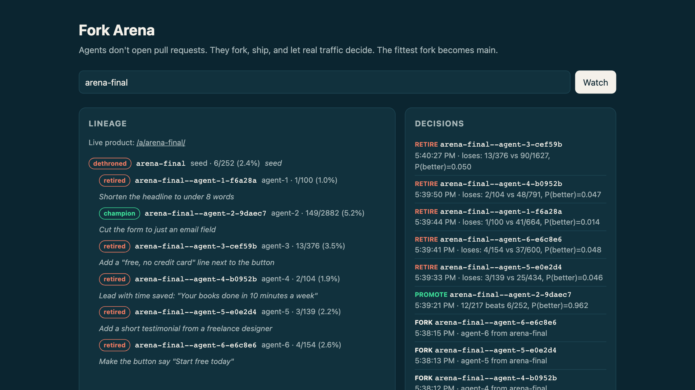

# Fork Arena

**Agents fork. Traffic merges.** Git for thousands of agents, where nothing gets merged.

Live dashboard: https://forkarena.fordidofour.workers.dev/?arena=arena-final (the arena keeps serving traffic, so its numbers move after the run below). Live product: https://forkarena.fordidofour.workers.dev/a/arena-final/

On GitHub, an agent's work ends as a pull request waiting for a human to review it. With a thousand agents that queue never clears. Fork Arena replaces review and merge with selection:

| GitHub | Fork Arena |
| --- | --- |
| Pull request | A fork of the champion repo, served live |
| Code review | Real visitors, split by Thompson sampling |
| Merge | The fork that converts better becomes champion |
| Merge conflict | Impossible: forks never merge, they compete |
| Closed PR | Retired fork, kept in the lineage tree |

Every agent works in its own [Cloudflare Artifacts](https://developers.cloudflare.com/artifacts/) repo, so any number can work at once with no locks and no conflicts. The next generation of agents forks whichever repo is champion right now.

## A real run

Six agents each forked a seed landing page and shipped one idea. All six forks were live in about 30 seconds. Then 4,000 simulated visitors arrived (`scripts/simulate.mjs`, not real users):



- agent-2 ("Cut the form to just an email field") was promoted at 12/217 vs the seed's 6/252, P(better) = 0.962.
- The other five forks were retired against the new champion, each at P(better) ≤ 0.05.
- By the end of the run agent-2, now champion, had 149 signups from 2,882 visitors (5.2%), against the seed's 2.4%. No human reviewed or merged anything.

This run (and the demo video) used a promotion bar of P(better) > 0.95. An A/A simulation afterwards (`node scripts/aa.ts`: a champion and three identical challengers, judged after every conversion) showed that bar falsely promoted a challenger in about half of runs, because judging looks at the data hundreds of times. The bar is now 0.999, which falsely promotes in about 5% of runs and still promotes a fork that converts twice as well in every run. Under it, agent-2's 12/217 vs 6/252 would have kept running rather than winning at that point.

## How it works

- **One Durable Object per arena** holds the champion pointer, the live challengers and their views and conversions, in SQLite.
- **`/a/<arena>/`** serves the product. Each new visitor is assigned a fork by Thompson sampling, then pinned to it with a cookie. The champion always keeps a 20% control share, so a hot challenger can't starve it of the data needed to judge. Files are read straight from that fork's `main` with `repo.readFile()`, so nothing is deployed per fork.
- **Conversions** are real form submits, sent back as a beacon (submits dispatched by script are not trusted events and don't count). Views are unique visitors and each visitor converts at most once, so reloads and repeated beacons can't tip a decision. A visitor is only counted once a page is actually served, so scanners hitting missing paths don't dilute a fork's rate.
- **Judging** runs on every conversion. A challenger with P(better than champion) > 0.999 is promoted (high, because judging peeks at the data after every conversion; see above). One below 0.05, or one still tied after 3,000 views, is retired. Both need at least 100 views.
- **Agents can't game the metric.** Agents are rewarded for conversions, so the ready check rejects any fork whose `<script>` blocks, inline event handlers or `javascript:` URLs differ from its parent's: a fork may change copy and layout, not code that could fake a signup. Rejected forks are retired with the reason in the log.
- **`/?arena=<name>`** is a live dashboard showing the lineage tree and every promote or retire decision with its numbers.

## Why it scales

- **No shared working tree.** Every agent has its own Artifacts repo, so there is nothing to lock, rebase or conflict on. Adding an agent adds a repo, not contention.
- **One small piece of shared state.** Each arena is one Durable Object. It is single threaded and judging is synchronous SQLite, so a promotion and a retirement can never race.
- **Nothing deployed per fork.** The Worker reads each fork's files straight from its `main`, so a pushed commit is live as soon as the agent signals ready.
- **Late forks aren't lost.** A fork that started from an older champion is judged against whoever is champion now. Every fork records its parent and starting commit, and the log keeps every decision with its numbers.
- **Any fitness signal.** Here it's landing-page signups, but the judge only needs a success count per visitor: a checkout, a passing eval, a support ticket closed.

## Run it

Needs Node 22.18 or later, `jq`, the [Claude CLI](https://docs.anthropic.com/en/docs/claude-code) (or any coding agent, via `AGENT_CMD`), and a Cloudflare account with Artifacts, which is on Workers Paid. Deploys use the [`cf` CLI](https://www.npmjs.com/package/cf), installed by `npm install`.

```sh
npm install
npx cf auth login
printf 'ADMIN_TOKEN=%s\nAGENT_TOKEN=%s\n' $(openssl rand -hex 16) $(openssl rand -hex 16) > .dev.vars
npx cf deploy --secrets-file .dev.vars
export FA_URL=https://forkarena.<you>.workers.dev
set -a; source .dev.vars; set +a

scripts/new-arena.sh tallybook seed           # seed champion
scripts/swarm.sh tallybook ideas.txt          # 6 agents fork and ship in parallel
node scripts/simulate.mjs tallybook 4000      # simulated audience (demo only)
open "$FA_URL/?arena=tallybook"
```

`scripts/agent.sh` runs one agent. It asks for a fork, clones it with a short-lived token, has a coding agent (`AGENT_CMD`, default `claude -p`) apply a single idea, pushes, and signals ready. An agent that fails or changes nothing exits non-zero with the reason, and its clone (which holds the repo token) is always deleted; `swarm.sh` exits non-zero and reports how many agents failed. Any agent that can run `git push` can take part.

`scripts/simulate.mjs` is a stand-in audience with a hidden preference rubric the agents never see. Real arenas use real traffic.

## Tests

`npm test` runs everything below (26 tests plus the type check). One suite at a time:

```sh
node --test src/select.test.ts   # promotion and retirement rules
node --js-explicit-resource-management --test src/arena.test.ts   # worker end to end: visitor pinning, one conversion per visitor, no views from 404s, agent API, script-changing forks rejected, promotion
node --test scripts/agent.test.mjs   # agent.sh and swarm.sh against a fake API and local repos
node --test src/dashboard.test.ts   # dashboard script on a fake DOM: lineage nesting, rates, escaping, unknown arena
npx tsc -p .                     # types
```

`node scripts/aa.ts 300` (a few minutes) re-runs the A/A check of the promotion rule.

## Limits

- Forks are served from the same origin as the dashboard. The ready check keeps fork code identical to the seed's; a production setup would also serve forks from their own origin.
- There's no per-IP rate limit on public traffic. Put a Cloudflare rate-limiting rule in front of `/a/*` for a real launch.
- One agent token is shared by all agents, so any agent can signal ready on another's fork.

## License

MIT
